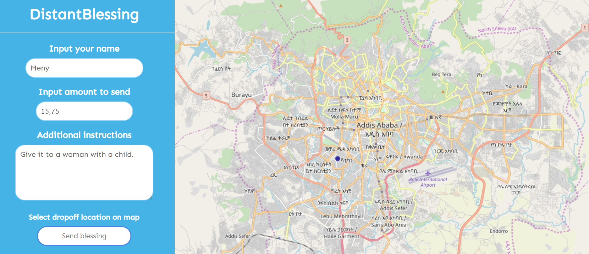
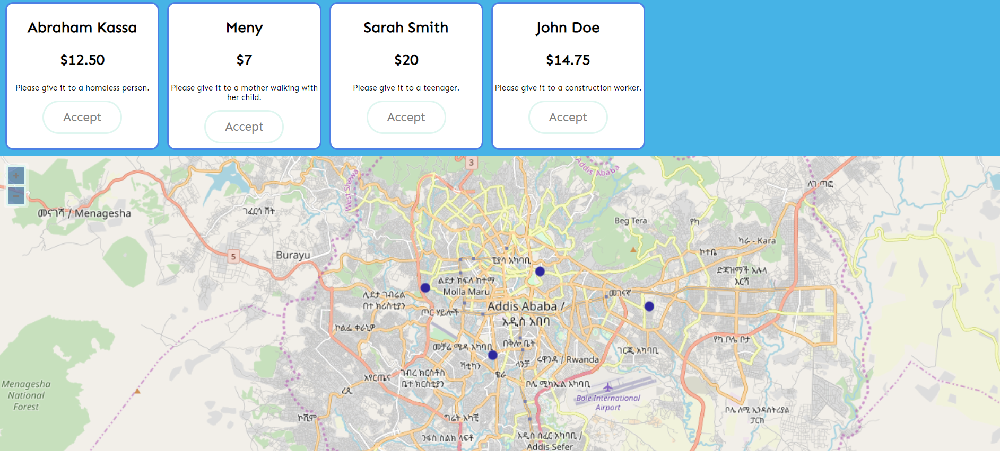

# DistantBlessing

Part of the Sustainable Development Goals rapid prototyping series.

**Sustainable Development Goal #1: No poverty**.

Deliver donations directly to a location of your choosing. 

Add the amount to deliver, additional instructions and the specific location to drop off to by placing a marker on the map. After confirming, a push message is sent to the deliverer which shows all information about the delivery together with the option to accept the delivery.

Application consists of a web interface for the donator, a web interface for the deliverer and a server handeling communication between the two web interfaces.

Server is created using Nodejs (with Express) and handles REST API calls as well as Websocket connections for push notifications.

